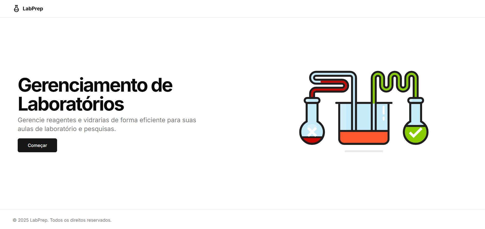
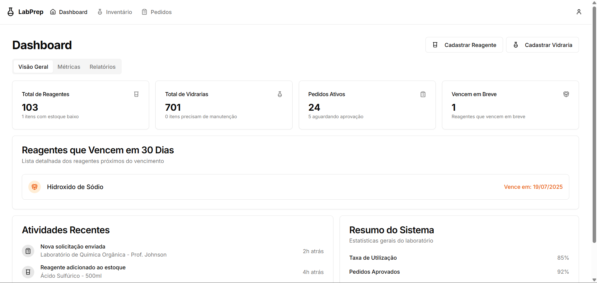
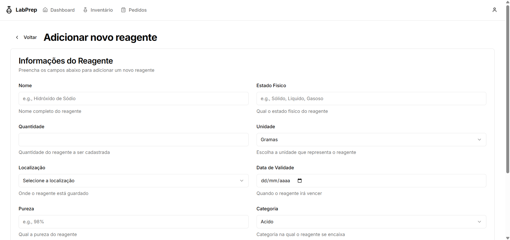

# 🧪 LabPrep

O **LabPrep** é um sistema digital criado para modernizar a gestão  e solicitações de uso em laboratórios acadêmicos. Ele foi desenvolvido com o objetivo de facilitar o dia a dia de professores e servidores que precisam controlar o uso e o empréstimo de materiais laboratoriais de forma simples, rápida e eficiente.

---

## 🧩 Sobre o projeto

Em muitos laboratórios, o controle de vidrarias e equipamentos ainda é feito de forma manual, com planilhas ou até papel. Isso pode gerar erros, perda de informações e retrabalho. O **LabPrep** surge para resolver esse problema com uma solução digital acessível, organizada e visualmente agradável.

---

## 🎯 Funcionalidades

- Cadastro e controle de vidrarias disponíveis no laboratório.
- Solicitação de uso feita por professores via interface web.
- Área administrativa para servidores gerenciarem os pedidos.
- Interface clara, rápida e intuitiva.
- Sistema seguro com autenticação por login.

---

## 💻 Tecnologias utilizadas

- **Frontend**: React, TypeScript e TailwindCSS
- **Backend**: Node.js, Express, TypeScript e Prisma
- **Banco de Dados**: PostgreSQL
- **Hospedagem**: Vercel (Frontend) e Railway (Backend)
- **Ambiente de desenvolvimento**: Docker

---

## 📷 Interface

O sistema foi pensado para ser simples e direto, com telas modernas e responsivas. Animações leves e ícones intuitivos ajudam o usuário a entender facilmente cada ação dentro da plataforma.

### Capturas de tela:

#### Tela inicial

#### Dashboard

#### Cadastro de Reagentes

---

## 🌐 Acesso

O sistema está atualmente disponível online por meio da Vercel:

🔗 [Acesse o LabPrep](https://labprep-project.vercel.app/)

---

## 👨‍💻 Desenvolvimento

Este projeto foi desenvolvido com foco em aprendizado prático de tecnologias modernas do ecossistema web. Serviu como uma forma de aplicar conhecimentos em:

- Criação de APIs REST seguras e organizadas.
- Consumo de APIs no frontend com Axios.
- Gerenciamento de estado, autenticação e controle de sessões.
- Deploy e versionamento com ferramentas modernas.

---

## ✉️ Contato

Caso queira saber mais sobre o projeto, dar sugestões ou apenas trocar ideias, entre em contato:

📧 seu-email@exemplo.com  
🔗 [github.com/seu-usuario](https://github.com/seu-usuario)

---

## 📄 Licença

Projeto de código aberto — MIT License.
